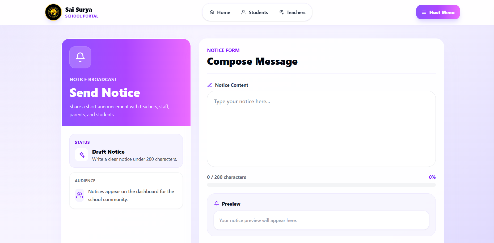
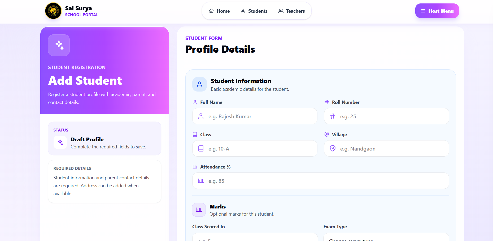
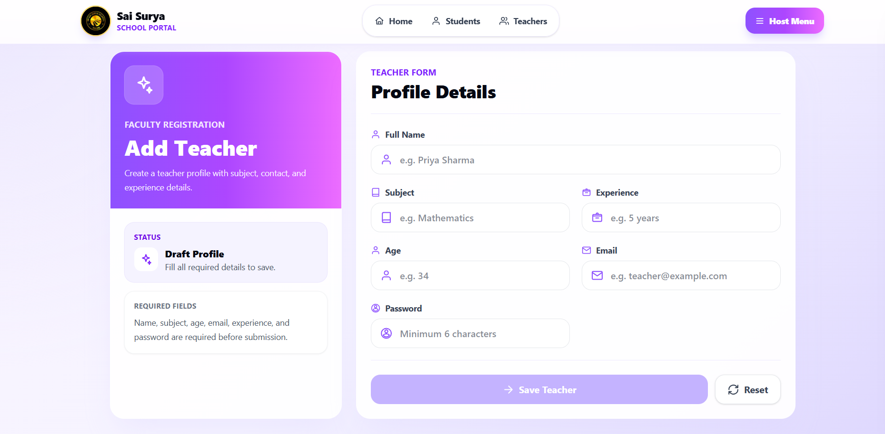
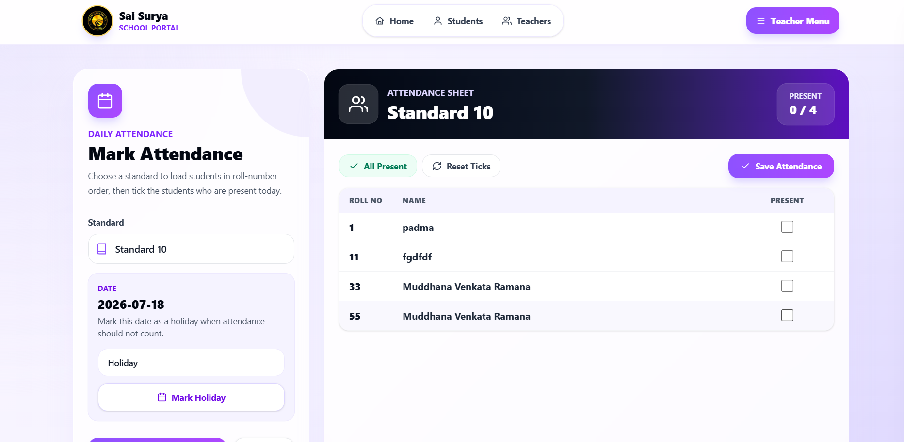

# Sai Surya School Management System - Frontend


Sai Surya School Management System is a full-stack MERN application designed to manage student records, teacher information, attendance, marks, and school notices. This repository contains the React frontend, which provides role-based interfaces for administrators (Principal) and teachers.

## Live Demo

https://sai-surya-frontend.vercel.app/

## Backend Repository

[Akash-Muddhana/sai-surya-backend](https://github.com/Akash-Muddhana/sai-surya-backend)

## Project Highlights

- Role-based frontend flows for host and teacher users.
- Student records, marks, attendance, teacher profiles, and notices managed through API-backed screens.
- Responsive Tailwind CSS interface with form validation, loading states, and protected route handling.
- Deployed frontend configured for Vercel with SPA rewrites.

## Architecture

```text
React Components
        |
        v
React Router
        |
        v
Service Layer
        |
        v
Express REST API
        |
        v
MongoDB
```

## Features

- Home page with school result highlights, notice display, school statistics, and image gallery.
- Public student lookup by standard and roll number.
- Authenticated host and teacher access using email and password login.
- Host tools for adding teachers, adding students, posting notices, editing teacher profiles, and deleting teacher profiles.
- Teacher tools for adding students and marking daily attendance.
- Student marks viewing by standard, roll number, class, academic year, and exam type.
- Authenticated marks entry with default subjects and support for custom subjects.
- Attendance marking by standard, including all-present/reset actions and holiday marking.
- Teacher directory with name search and subject filtering.
- Token-based session checks and logout.
- Client-side form validation for login, teacher, student, marks, notice, and attendance workflows.

## Tech Stack

### React

- React 19
- React DOM
- Functional components
- React hooks: `useState`, `useEffect`, `useMemo`

### State Management

- Local component state with React hooks
- Browser `localStorage` for storing the authentication token

### Routing

- `react-router-dom`
- `BrowserRouter`
- `Routes` and `Route`
- `Link`
- `useNavigate`
- `useSearchParams`

### Styling

- Tailwind CSS
- Tailwind CSS Vite plugin
- Local CSS files: `src/index.css` and `src/App.css`


### API Communication

- Native `fetch`
- `axios` for session validation requests

### Build Tool

- Vite
- `@vitejs/plugin-react`

### Other Libraries

- ESLint
- `@eslint/js`
- `eslint-plugin-react-hooks`
- `eslint-plugin-react-refresh`
- `globals`

## Project Structure

```text
my-app/
|-- public/                 # Static public assets, including favicon and icons
|-- services/               # API helpers for auth, students, teachers, and notices
|-- src/
|   |-- assets/             # Images used by the home page and header
|   |-- components/         # Shared UI components
|   |-- pages/              # Main route-level pages
|   |   |-- host/           # Host login and host-only management pages
|   |   `-- teacher/        # Teacher login and attendance pages
|   |-- App.jsx             # Route definitions and login state
|   |-- main.jsx            # React entry point and router setup
|   |-- index.css           # Tailwind import
|   `-- App.css             # Additional CSS from the app scaffold
|-- .env.example            # Example API base URL
|-- eslint.config.js        # ESLint configuration
|-- index.html              # Vite HTML entry point
|-- package.json            # Scripts and dependencies
|-- vercel.json             # SPA rewrite configuration for Vercel
`-- vite.config.js          # Vite, React, and Tailwind plugin setup
```

## Screenshots

### Home Page


### Principal Dashboard


### Login Page


### Student Details


### Teacher Details


### Add Notice



### Add Student



### Add Teacher



### Mark Attendance



## Installation

Clone the repository:

```bash
git clone https://github.com/Akash-Muddhana/sai-surya-frontend
cd "sai surya frontend/my-app"
```

Install dependencies:

```bash
npm install
```

Start the development server:

```bash
npm run dev
```

Build for production:

```bash
npm run build
```

Preview the production build:

```bash
npm run preview
```

## Environment Variables

Create a `.env` file in `my-app/` when running against a custom backend.

```env
VITE_API_BASE_URL=http://localhost:5000
```

| Variable | Description |
| --- | --- |
| `VITE_API_BASE_URL` | Base URL used by the frontend service layer. If it is not set, the app falls back to `https://sai-surya-backend.vercel.app/`. |

## API Integration

The frontend communicates with the Sai Surya backend through routes under `/api`. The API base URL is built in `services/api.js` from `VITE_API_BASE_URL`, with a deployed backend fallback.

API requests are grouped by domain:

- `services/authservice.js` handles host login, teacher login, and logout.
- `services/studentservice.js` handles student creation, student lookup, marks, attendance, and holidays.
- `services/teacherservice.js` handles teacher creation, listing, updates, and deletion.
- `services/noticeservice.js` handles notice creation and retrieval.

Authentication is token-based. Login responses store `data.token` in `localStorage` as `token`, and authenticated requests send it with the `Authorization: Bearer <token>` header. The header component and protected pages validate sessions against `/api/auth` and `/api/auth/teacher`.

## Responsive Design

The application uses responsive Tailwind utility classes such as `sm:`, `md:`, `lg:`, and `xl:` across the header, page layouts, cards, forms, galleries, and data grids. The header includes a mobile menu button and slide-out menu for smaller screens.

## Key Concepts Demonstrated

This project demonstrates:

- Building route-based React applications with React Router.
- Managing local UI state with React hooks.
- Fetching and submitting data through a small service layer.
- Handling token-based authentication in a frontend application.
- Creating protected UI flows based on authentication state.
- Building reusable form patterns with validation and loading states.
- Using Tailwind CSS for responsive layouts and component styling.

## Future Improvements

- Export student reports and marksheets as PDF files.
- Add student fee management.
- Add parent login for viewing student records, marks, attendance, and notices.
- Improve performance for larger student and teacher datasets.
- Add dark mode support.

## License

MIT License.
